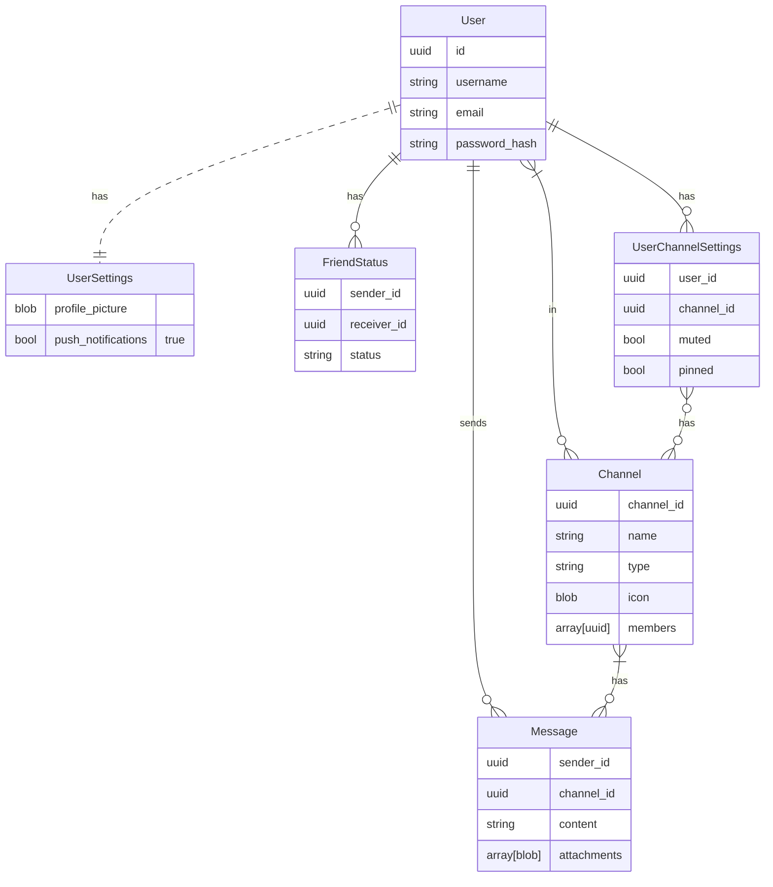

# PSQL Table Declaration

The following tables will require the following extensions:

```psql
/* added by postgres-contrib */
CREATE EXTENSION IF NOT EXISTS "uuid-ossp";
```

And can be created with the following statements:

```psql
CREATE TABLE users (
    id UUID PRIMARY KEY DEFAULT uuid_generate_v4(),
    username VARCHAR(255) NOT NULL,
    email VARCHAR(255) NOT NULL UNIQUE,
    password_hash VARCHAR(255) NOT NULL
);

CREATE TABLE user_settings (
    user_id UUID PRIMARY KEY REFERENCES users(id) ON DELETE CASCADE,
    profile_picture BYTEA,
    push_notifications BOOLEAN NOT NULL
);

CREATE TABLE friend_status (
    sender_id UUID NOT NULL REFERENCES users(id) ON DELETE CASCADE,
    receiver_id UUID NOT NULL REFERENCES users(id) ON DELETE CASCADE,
    status VARCHAR(255) NOT NULL,
    PRIMARY KEY (sender_id, receiver_id)
);

CREATE TABLE channels (
    id UUID PRIMARY KEY,
    name VARCHAR(255) NOT NULL,
    type VARCHAR(255) NOT NULL,
    icon BYTEA,
    members UUID[] NOT NULL
);

CREATE TABLE messages (
    id UUID PRIMARY KEY,
    sender_id UUID NOT NULL REFERENCES users(id) ON DELETE CASCADE,
    channel_id UUID NOT NULL REFERENCES channels(id) ON DELETE CASCADE,
    content VARCHAR(255) NOT NULL,
    attachments BYTEA[]
);

CREATE TABLE user_channel_settings (
    user_id UUID NOT NULL REFERENCES users(id) ON DELETE CASCADE,
    channel_id UUID NOT NULL REFERENCES channels(id) ON DELETE CASCADE,
    muted BOOLEAN NOT NULL DEFAULT FALSE,
    pinned BOOLEAN NOT NULL DEFAULT FALSE,  
    PRIMARY KEY (user_id, channel_id)
);

CREATE TABLE channel_messages (
    channel_id UUID NOT NULL REFERENCES channels(id) ON DELETE CASCADE,
    message_id UUID NOT NULL REFERENCES messages(id) ON DELETE CASCADE,
    PRIMARY KEY (channel_id, message_id)
);
```
